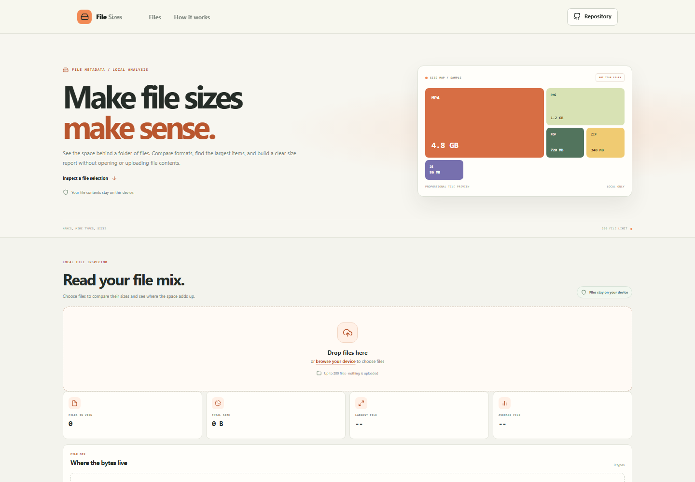



# File Size Visualizer

Review the size and type mix of a local file selection. Drop files into the page or choose them from your device, then compare totals, category shares, and individual entries in one report.

**Live app:** [https://a2rp.github.io/file-size-visualizer/](https://a2rp.github.io/file-size-visualizer/)

## What you can do

- Add files by drag and drop or with the browser file picker.
- View file count, total size, largest file, and average file size.
- Compare byte shares across images, video, audio, documents, archives, code, and other files.
- Search by file name or type, filter by category, and sort by size, name, or type.
- Remove one file from the report or clear all entries after confirming the action.
- Export a JSON report containing file metadata and category totals.
- Use the report on desktop or mobile.

## File handling and limits

The browser file picker provides names, MIME types, sizes, and modification times. The app reads metadata only. It never opens file contents, uploads files, or changes files on disk. Selected entries exist in the current page session and are cleared when the page is reloaded. Removing a row only removes it from the current report.

A report can contain up to 200 file entries. Sizes use base 1024 units, from bytes through petabytes. The JSON download includes file names, MIME types, byte sizes, categories, and the report timestamp, but no file contents.

## Run locally

Requires Node.js and npm.

```sh
npm install
npm run dev
```

Run the tests, check the code with ESLint, and create a production build:

```sh
npm test
npm run lint
npm run build
```

Publish the production build to GitHub Pages with:

```sh
npm run deploy
```

## Future improvements

These are ideas for later versions and are not implemented yet:

- Add folder selection where the browser supports it.
- Add duplicate-name and duplicate-size comparison tools.
- Add visual treemap layout for individual files.

## Links

- Portfolio: [https://www.ashishranjan.net](https://www.ashishranjan.net)
- GitHub: [https://github.com/a2rp](https://github.com/a2rp)
- CodePen: [https://codepen.io/ash1198](https://codepen.io/ash1198)
- LinkedIn: [https://www.linkedin.com/in/aashishranjan](https://www.linkedin.com/in/aashishranjan)
- Facebook: [https://www.facebook.com/theash.ashish/](https://www.facebook.com/theash.ashish/)
- YouTube: [https://www.youtube.com/@ashishranjan-ashz?sub_confirmation=1](https://www.youtube.com/@ashishranjan-ashz?sub_confirmation=1)
- Email: [mailto:ash.ranjan09@gmail.com](mailto:ash.ranjan09@gmail.com)

## Support

- Support: [https://a2rp-donation-page.netlify.app/](https://a2rp-donation-page.netlify.app/)
- Buy Me a Coffee: [https://buymeacoffee.com/ashishranjan](https://buymeacoffee.com/ashishranjan)
- Patreon: [https://www.patreon.com/ashishranjan](https://www.patreon.com/ashishranjan)
